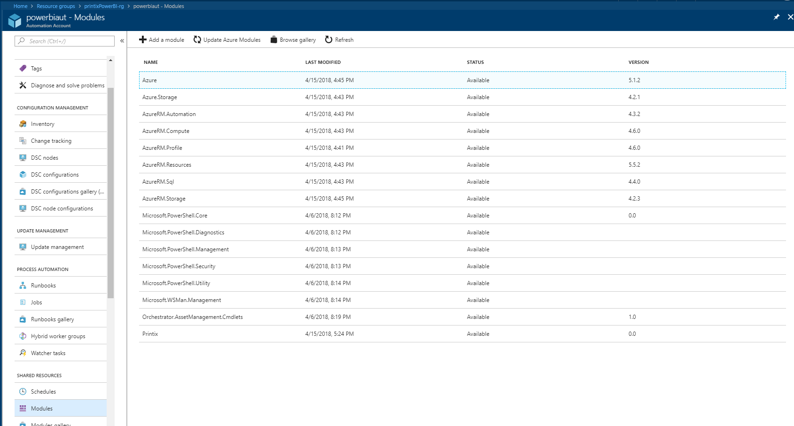
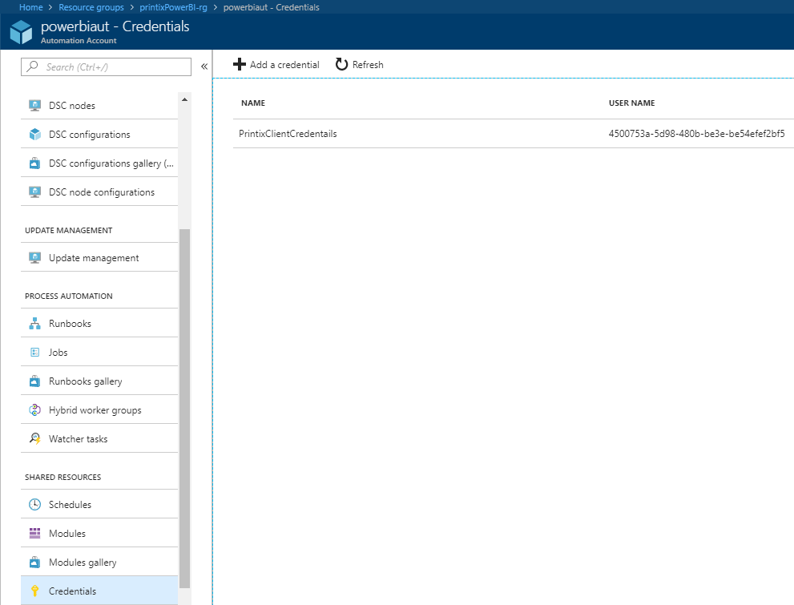
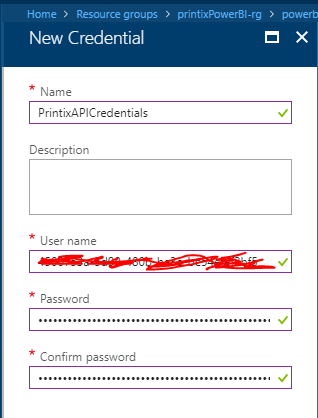
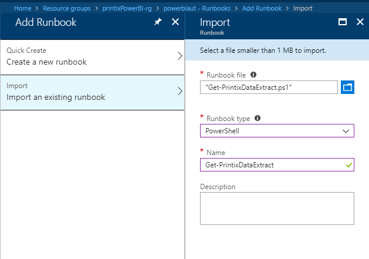
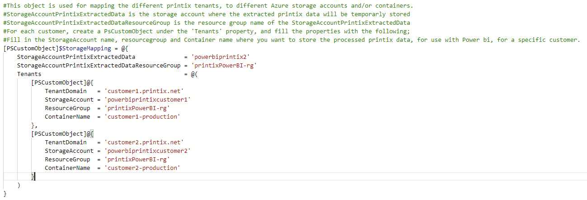
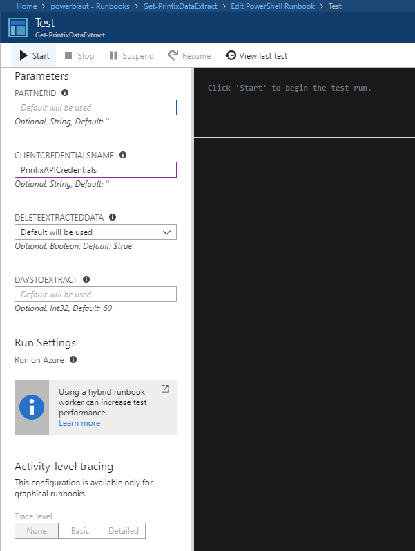
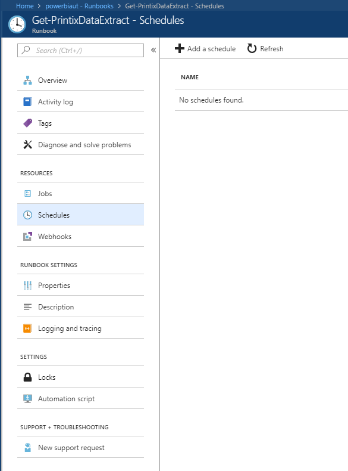
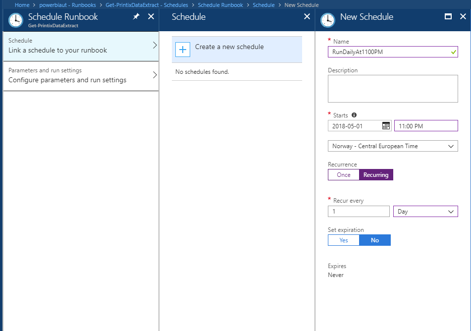
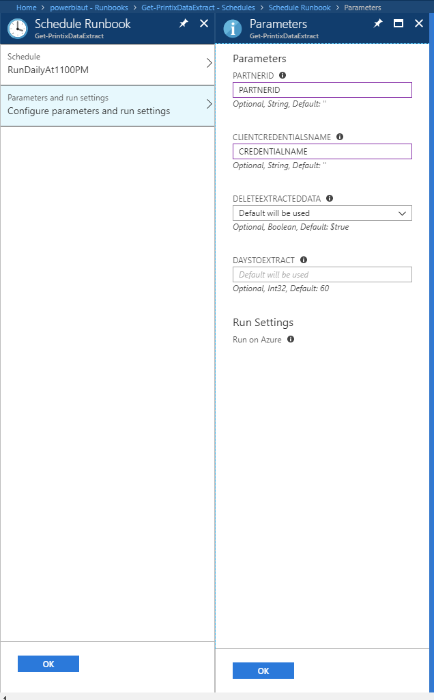

#Partner documentation

## Step 1 - Create an Azure Automation runbook, credentials and set a schedule

To ensure that the dataset is updated on a daily schedule, we will configure an Azure automation runbook to update the dataset.

### Step 1.1 Import Printix Module
The first thing you need to do is to import the Printix PowerShell module. Scroll down under the Automation Account and look under Shared Resources.

You’ll see **Modules** and **Modules gallery**. Before continuing, make sure that your modules are up to date! If your unsure, please click on **Update Azure Modules** and wait for the update process to proceed. After that, you can click on **Modules**.

 

To import the module into your Automation Account, click on **Add Module**. Select the "Printix.zip" file from the "Code\PowerShellModule" directory. Click **OK** to upload the file. When completed, you will see a notification that the module was imported successfully.

### Step 1.2 Create a credential asset
The second thing you will need to do, is to create a Credential asset, where you will store the Printix API ClientID and Secret. 

Scroll down under the Automation Account and look under **Shared Resources**.
Click on **Credentials**.
Click on **Add a credential**.

 

 In the **Name** field, ensure to give the asset a unique name. You will need this later.
 In the **User name** field you will enter the Printix API ClientID.
 In the **Password** and **Confirm Password** fields you will enter the Printix API secret.

 

### Step 1.3 Upload and edit the runbook
The third thing you will need to do, is to configure a runbook that will run the "Get-PrintixPartnerDataExtract.ps1" script daily.

Scroll down under the Automation Account and look for **Process Automation**. Click on **Runbooks**. In the top menu, click on **Add a runbook.** Select **Import an Existing runbook** and upload the **Get-PrintixPartnerDataExtract.ps1** file from under the **code** directory. Click **Create.**

 

 When the runbook is successfully imported, open the runbook by clicking on the **Get-PrintixPartnerDataExtract** runbook. In the top menu, click on **edit**.

Now you can edit the $StorageMapping object, so it reflects your own environment.
Follow the instructions carefully! Please note that the Storage accounts you specify here must exist **before** running the runbook!

 

 When you have successfully filled out the StorageMapping object, you should click **save** and then do a test of the code by clicking on the **test pane** button on the top menu.

Fill out the relevant parameters as described in the documentation.
**PartnerID** is your Printix partner ID.
**ClientCredentialsName** is the credential asset you created in step 1.2.
**DeleteExtractedData** will delete the temporary data extract if set to True (after it's successfully uploaded to its final destination).
**DaysToExtract** controls how many days of data to extract from the Printix API. The valid range is 1-89.

If you experience any problems while running the test, you should turn on verbose debugging by setting the $VerbosePreference variable to 'Continue' and rerun the test. This will give you a much more detailed output.

When your finished testing, head back to the **Edit PowerShell runbook** blade, and click on **Publish.**

 ### Step 1.4 Set a schedule

 To ensure we have updated data daily, we will set up a schedule to run the runbook on a daily basis.

 In the left menu of the **Get-PrintixPartnerDataExtract** runbook, select **Schedules** and hit the **Add a schedule** button.

First, click on **Link a schedule to your runbook** and follow the **Create a new schedule** wizard. An example schedule looks like this;

  Now click on **Configure parameters and run settings** and fill in the parameters.

Your now all set! The runbook will run on a daily schedule to ensure you have fresh data! 

Now continue the configuration by completing [step 2](../Readme.md).