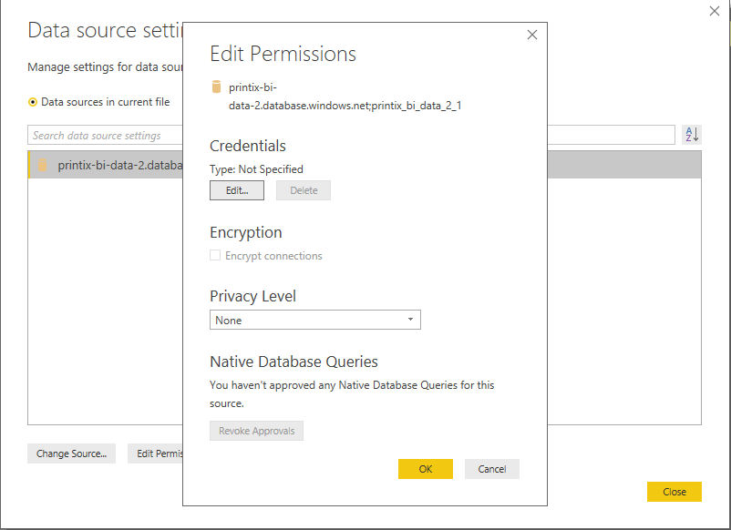
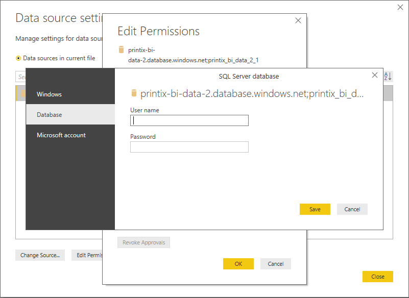

# Printix Power BI Solution Template
The Printix Power BI solution Template is designed to give you insights into your Print usage and contains insights into users, workstation, printers, print queues and much more. 

This solution contains multiple key components;
1. A Power BI solution Template.
2. A set of PowerPoint design templates and icons.

## Demo
A demo of the Printix solution template can be viewed [here](https://app.powerbi.com/view?r=eyJrIjoiNDRkYzNlOTMtMzcwZC00ODY4LWE5MGQtMzJlMWU2MDk5M2NmIiwidCI6IjNlYWFmMWQzLTZmOWUtNDBmZC1iN2U5LTYwYjQ1ZTU1ZTEyNSIsImMiOjh9).

# Getting started

The most simple usage of this Power BI template consists of opening it and analyzing your Printix data in PowerBI
Desktop on your own machine. To achieve this, only steps 1 and 2 from below are required.
Further, you can decide to publish it to your organization's online Power BI service in order to share the report with
other users (or even guests), embed visuals into your application, etc. This more advanced usage is described in steps 2-5.

## Prerequisites
1. You must install the Power BI desktop application either from [https://powerbi.microsoft.com](https://powerbi.microsoft.com/en-us/desktop/), or directly from the [Microsoft store](https://www.microsoft.com/nb-no/store/p/power-bi-desktop/9ntxr16hnw1t).
2. You must have a valid [Printix](https://www.printix.net) Subscription.
3. You must follow the [Printix Analytics](https://manuals.printix.net/administrator/1/en/topic/settings-page-analytics) documentation to get your data exported to a database.

## Step 1: Download the Power BI template

Download the Power BI template (.pbix file) from the [Releases](https://github.com/printix/Power-BI/releases/latest) section of
this repository and open it in your Power BI Desktop. By default, the reports will show the Printix data belonging
to a demo tenant (the same as the one in the live demo).

## Step 2: Change the data source

To start visualizing your Printix tenant's data, you must change the data source of the Power BI report.
From the ribbon menu, click **Edit Queries** -> **Data source settings**.

Right-click on **printix-bi-data-2.database.windows.net;printix_bi_data_2_1** and select **Change Source...**

Replace the **Server** and **Database** values with values from when you configured [Printix Analytics](https://manuals.printix.net/administrator/1/en/topic/settings-page-analytics?q=power) and hit **OK** and **Close**.

At this stage, if you want to start visualizing the data in your Power BI Desktop you must also add your database credentials that
the report should use. To do that, right-click on the data source and select **Edit permissions**. In the newly opened dialog,
click the **Edit** button under **Credentials**.

Now, on the left side, select **Database** and insert your database username and password
in the input fields presented in the dialog.

Finish by clicking the **Save** button. Refreshing the report now should now reload and display your tenant's data.

## Step 3: Publish the report

From the ribbon menu, click **Publish** (to the right, under share).

 

Select the destination where you want to publish the report, and click **select**.

 

When the report is published , you can click on **Open 'printix.PBIX' in Power BI** to open the report in Power BI Online.

 

## Step 4: Set the source credentials
Navigate to the Dataset settings. Click on **Edit Credentials** under **Data source credentials**. Select **Basic** As the Authentication method and enter the user name and Password from [Printix Analytics](https://manuals.printix.net/administrator/1/en/topic/settings-page-analytics?q=power) and click **sign in**. 

 

## Step 5: Set up a schedule

To refresh the data daily, you need to configure a scheduled refresh. Click on **Scheduled refresh** under the datasets settings. The refresh should run 15-30 minutes after the data export from Printix is finished.

Example of a scheduled refresh; 

 

 Now do a [manual refresh]( https://docs.microsoft.com/en-us/power-bi/refresh-data) of your dataset, and you’re ready!

# Editing the Power BI template
You can freely alter the Power BI templates as needed for your organization. If you create something awesome, we hope you will share it back with the community!

## Changing the Power BI design
The Power BI design is created in PowerPoint and can easily be edited. You can find the design under the "PowerPoint" folder. The design is mostly built using Storyboards.

When you have altered the design in PowerPoint, and exported the slides as "PNGs", you can set them as background images in Power BI. This is done from the "Visualizations" view. Remember to set the "image fit" selector to "fit". 
The Images from PowerPoint is saved under the 'Images\PowerPoint' directory.

 