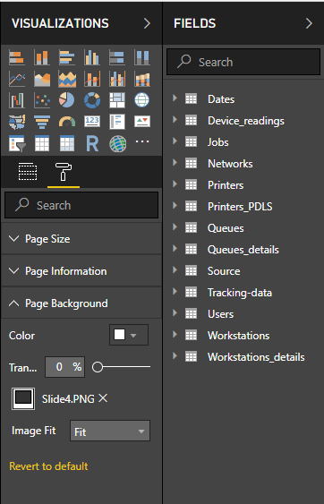

# Printix Power BI Solution Template
The Printix Power BI solution Template is designed to give you insights into your Print usage and contains visualizations of
data regarding users, workstation, printers, print queues and much more.

This solution contains multiple key components;
* A Power BI solution Template.
* A set of PowerPoint design templates and icons.

The most simple usage of this Power BI template consists of opening it and analyzing your Printix data in PowerBI
Desktop on your own machine.
Further, you can decide to publish it to your organization's online Power BI service in order to share the report with
other users (or even guests), embed visuals into your application, etc.

## Demo
A demo of the Printix solution template can be viewed [here](https://app.powerbi.com/view?r=eyJrIjoiNDRkYzNlOTMtMzcwZC00ODY4LWE5MGQtMzJlMWU2MDk5M2NmIiwidCI6IjNlYWFmMWQzLTZmOWUtNDBmZC1iN2U5LTYwYjQ1ZTU1ZTEyNSIsImMiOjh9).

# Getting started
To start using the Printix Power BI solution, follow the steps described in the Printix Administrator Manual:
1. [Setup Printix Analytics](https://manuals.printix.net/administrator/topic/how-to-setup-analytics)
2. [Setup Power BI](https://manuals.printix.net/administrator/topic/how-to-setup-power-bi)
3. (Optional) [Publish the report to Power BI Online Service](https://manuals.printix.net/administrator/topic/how-to-publish-to-power-bi-on-the-web)

Read more about what you can find in the report [here](https://manuals.printix.net/administrator/topic/how-to-interact-with-power-bi-report).

# Editing the Power BI template
You can freely alter the Power BI templates as needed for your organization. If you create something awesome, we hope you will share it back with the community!

## Changing the Power BI design
The Power BI design is created in PowerPoint and can easily be edited. You can find the design under the "PowerPoint" folder. The design is mostly built using Storyboards.

When you have altered the design in PowerPoint, and exported the slides as "PNGs", you can set them as background images in Power BI. This is done from the "Visualizations" view. Remember to set the "image fit" selector to "fit". 
The Images from PowerPoint is saved under the 'Images\PowerPoint' directory.

 