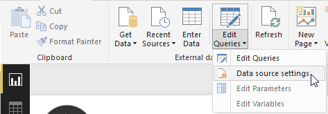
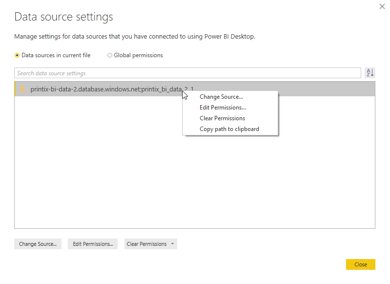
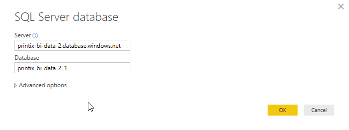
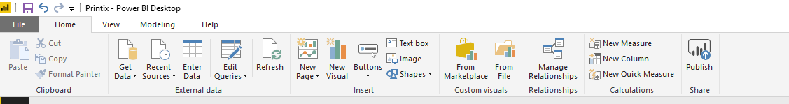
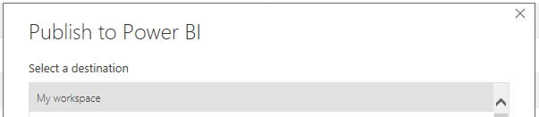
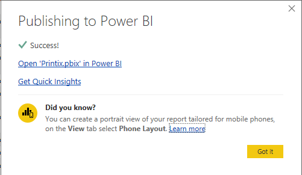
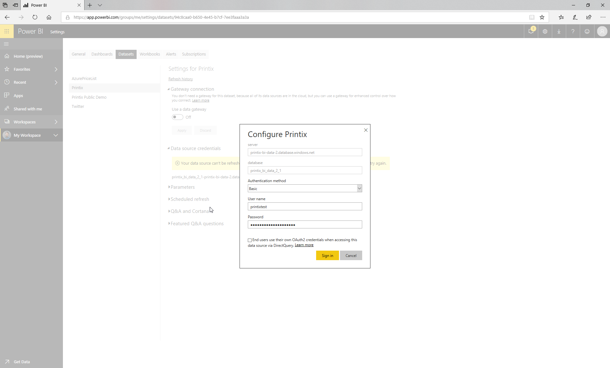
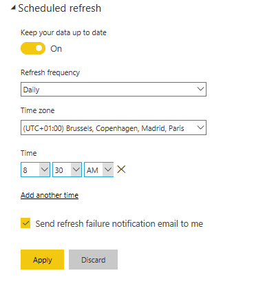

# Printix Power BI Solution Template
The Printix Power BI solution Template is designed to give you insights into your Print usage and contains insights into users, workstation, printers, print queues and much more. 

This solution contains multiple key components;
1. A Power BI solution Template.
2. A set of PowerPoint design templates and icons.

## Demo
A demo of the Printix solution template can be viewed [here](https://app.powerbi.com/view?r=eyJrIjoiNDRkYzNlOTMtMzcwZC00ODY4LWE5MGQtMzJlMWU2MDk5M2NmIiwidCI6IjNlYWFmMWQzLTZmOWUtNDBmZC1iN2U5LTYwYjQ1ZTU1ZTEyNSIsImMiOjh9).

Please note that after a commit to the public demo solution, it might take one hour before the change is visible. 

# Getting started

## Prerequisites
1. You must install the Power BI desktop application either from [https://powerbi.microsoft.com](https://powerbi.microsoft.com/en-us/desktop/), or directly from the [Microsoft store](https://www.microsoft.com/nb-no/store/p/power-bi-desktop/9ntxr16hnw1t).
2. You must have a valid [Printix](https://www.printix.net) Subscription.
3. You must follow the [Printix Analytics](https://manuals.printix.net/administrator/1/en/topic/settings-page-analytics) documentation to get your data exported to a database.

## Step 1 - Deploy the Power BI report and configure a scheduled update 

To ensure everyone in your organization, or even guests, can view the report, you have to publish it to Power BI online.

### Step 1.1 Change the data source
Before uploading the report to Power BI online you first have to open the **Printix.PBIX** from the **PowerBI** directory in Power BI desktop.

From the ribbon meny, click **Edit Qeries** -> **Data source settings**.

Right click on **printix-bi-data-2.database.windows.net;printix_bi_data_2_1** and select **Change Source...**

Replace the **Server** and **Database** values with values from when you configured [Printix Analytics](https://manuals.printix.net/administrator/1/en/topic/settings-page-analytics?q=power) and hit **OK** and **Close**.

### Step 1.2 Upload the report

From the ribbon menu, click **Publish** (to the right, under share).

 

Select the destination where you want to publish the report, and click **select**.

 

When the report is published , you can click on **Open 'printix.PBIX' in Power BI** to open the report in Power BI Online.

 

### Step 1.3 Set the source credentials
Navigate to the Dataset settings. Click on **Edit Credentials** under **Data source credentials**. Select **Basic** As the Authentication method and enter the user name and Password from [Printix Analytics](https://manuals.printix.net/administrator/1/en/topic/settings-page-analytics?q=power) and click **sign in**. 

 

### Step 1.4 Set up a schedule

To refresh the data daily, you need to configure a scheduled refresh. Click on **Scheduled refresh** under the datasets settings. The refresh should run 15-30 minutes after the data export from Printix is finished.

Example of a scheduled refresh; 

 

 Now do a [manual refresh]( https://docs.microsoft.com/en-us/power-bi/refresh-data) of your dataset, and you’re ready!

# Editing the Power BI template
You can freely alter the Power BI templates as needed for your organization. If you create something awesome, we hope you will share it back with the community!

## Changing the Power BI design
The Power BI design is created in PowerPoint and can easily be edited. You can find the design under the "PowerPoint" folder. The design is mostly built using Storyboards.

When you have altered the design in PowerPoint, and exported the slides as "PNGs", you can set them as background images in Power BI. This is done from the "Visualizations" view. Remember to set the "image fit" selector to "fit". 
The Images from PowerPoint is saved under the 'Images\PowerPoint' directory.

 