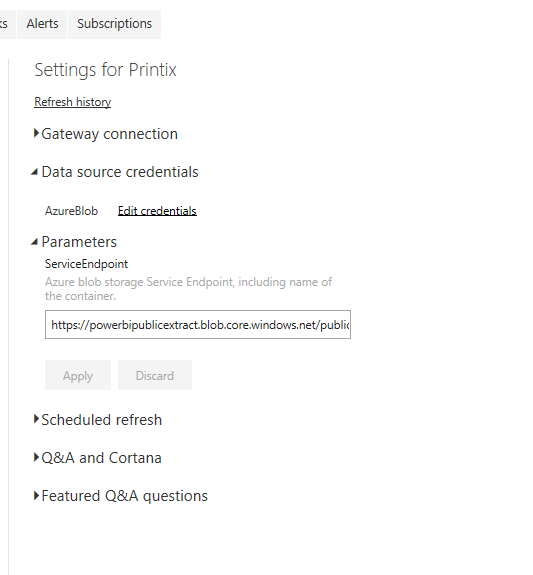
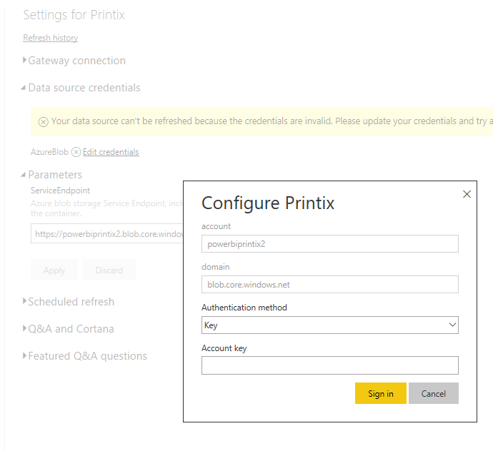
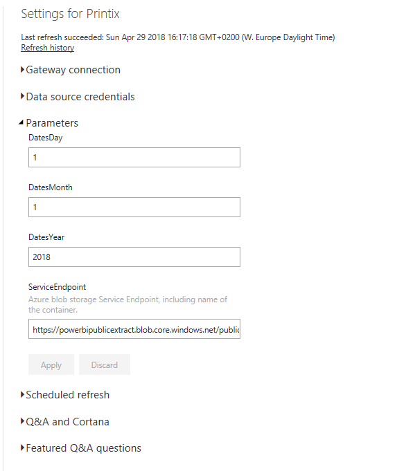

# Printix Power BI Solution Template
The Printix Power BI solution Template is designed to give you insights into your Print usage and contains insights into users, workstation, printers, print queues and historic data. 

This solution contains multiple key components;
1. A Power BI solution Template.
2. A Printix API PowerShell Wrapper.
3. A PowerShell script that extracts data from the Printix API and stores it in an Azure blob storage container. 
4. A set of PowerPoint design templates and icons.
5. A set of example data you can work with.

## Demo
A demo of the Printix solution template can be viewed [here](https://app.powerbi.com/view?r=eyJrIjoiNGZhMjJlMTMtYzgwZi00ZmRkLWExNzItZjUxMTFhNWQxM2U2IiwidCI6IjNlYWFmMWQzLTZmOWUtNDBmZC1iN2U5LTYwYjQ1ZTU1ZTEyNSIsImMiOjh9). 

Please note that after a commit to the public demo solution, it might take one hour before the change is visible. 

# Getting started

## Prerequisites
1. You must install the Power BI desktop application either from [https://powerbi.microsoft.com](https://powerbi.microsoft.com/en-us/desktop/), or directly from the [Microsoft store](https://www.microsoft.com/nb-no/store/p/power-bi-desktop/9ntxr16hnw1t).
2. You must have a valid [Printix](printix.net) Subscription.
3. You must meet the prerequisites for using the [Printix API](https://printix.bitbucket.io/index-005e71b7-013f-4dbb-9227-020367495ac4.html).
4. You must have a valid [Azure Subscription](https://azure.microsoft.com/en-us/free/).
5. You must have provisioned a Storage account (general purpose V2 or V1) with a container (blob). If you’re unsure on how to do that, you can read [About Azure storage accounts](https://docs.microsoft.com/en-us/azure/storage/common/storage-create-storage-account).
6. You must have provisioned an Azure Automation account. If you’re unsure on how to do that, you can read the [Create a Standalone Azure Automation Account](https://docs.microsoft.com/en-us/azure/automation/automation-create-standalone-account).

## Step 1 - Create an Azure Automation runbook, credentials and set a schedule

This step is different for Direct customers and Partners. Follow to appropriate documentation found here;
- [Partner documentation](./Documentation/ReadmeForPartners.md)
- [Direct Customer documentation](./Documentation/ReadmeForDirectCustomers.md)

## Step 2 - Deploy the Power BI report and configure a scheduled update

To ensure everyone in your organization, or even guests, can view the report, you have to publish it to Power BI online.

### Step 2.1 Upload the report
To upload the report to Power BI online, you first have to open the **Printix.pbix** from the **PowerBI** directory in Power BI desktop.

From the ribbon menu, click **Publish** (to the right, under share).

 

Select the destination where you want to publish the report, and click **select**.

 

When the report is published , you can click on **Open 'printix.pbix' in Power BI** to open the report in Power BI Online.

 

### Step 2.2 Change the data source
Navigate to the Dataset settings and click on **Parameters**. Under the **ServiceEndpoint** parameter, enter the Service Endpoint of your Azure blob storage (Found under **properties** of your storage account), including the container name and click **apply**. Example; https://powerbipublicextract.blob.core.windows.net/public

 

### Step 2.3 Set the source credentials
After changing the parameter, you need to update the source credentials. Click on **Edit Credentials** under **Data source credentials**. In the **account key** field, enter an Access keys (Found under the **Access keys** menu for the storage account.) for the storage account and click **sign in**. 

 

### Step 2.4 Set up a schedule

To refresh the data daily, you need to configure a scheduled refresh. Click on **Scheduled refresh** under the datasets settings. The refresh should run 15-30 minutes after the Automation runbook is scheduled to run, to ensure that the data is updated.

Example of a scheduled refresh; 

 

 Now do a [manual refresh]( https://docs.microsoft.com/en-us/power-bi/refresh-data) of your dataset, and you’re ready to view your data!

# Editing the Power BI template
You can freely alter the Power BI templates as needed for your organization. If you create something awesome, we hope you will share it back with the community!

## Changing the Power BI design
The Power BI design is created in PowerPoint and can easily be edited. You can find the design under the "PowerPoint" folder. The design is mostly built using Storyboards.

When you have altered the design in PowerPoint, and exported the slides as "PNGs", you can set them as background images in Power BI. This is done from the "Visualizations" view. Remember to set the "image fit" selector to "fit". 
The Images from PowerPoint is saved under the 'Images\PowerPoint' directory.

 

## Altering date ranges in the time sliders
The time sliders are calculated from the earliest date in the "Dates" table. To ensure all data with dates can be filtered simultaneously, any table with time columns are related to the dates table.

By default, all pages in the report only shows data from the last 90 days (Report level filter). The time sliders will always reflect this.

If you for some reason want to change the start time of the "Dates" table, you can do that from the Power BI parameters, either in Power BI desktop or in Power BI online. 

 

# Editing the PowerShell Code

## Changing the timestamp of the logs
If you want to use another timestamp for logging, you can change the "$Global:TimestampFormat" parameter in the "Get-PrintixDataExtract.ps1" file according to [Standard DateTime formats](https://ss64.com/ps/syntax-dateformats.html).

# Troubleshooting

## Exception: The remote server returned an error: (400) Bad Request

If the runbook fails with an 400 bad request, this is usually caused by one of two problems;
- Your Powershell Modules are out of date. Read [here](https://docs.microsoft.com/en-us/azure/automation/automation-update-azure-modules) for how you can update them.
- The run as account does not have the necessary permissions to get a storage account key.Read more [here](https://docs.microsoft.com/en-us/azure/automation/automation-create-runas-account).

## Exception: The remote server returned an error: (500) Internal server Error

If the runbook fails with an 500 bad request, this is usally caused by one of three problems;
- You specified an invalid Printix partnerID, ClientID or secret
- You specified an invalid printix tenant
- You passed on an invalid timespam